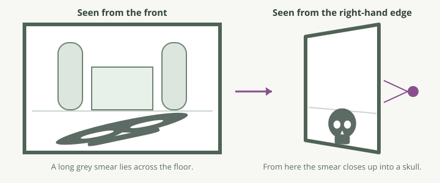

Session 3 ended with a warning: so far nobody had tried to stop you. Today someone has. The unit returns to the client's evidence, the NIST CFReDS Data Leakage Case, and to the suspect's last day at the company.

Actions that a person takes to hide, change or destroy evidence are called . You have already met three simple forms. In Session 2 the suspect renamed documents as pictures and gave his USB stick a quick format. In Session 3 a partition was removed from a partition table. None of them touched the content, so each one failed against a careful examiner.

Today's forms go further. Some destroy the content. Some make it unreadable. Some hide the fact that it exists, or lie about when it was made. As in Session 3, the unit drills each method first on material that it built itself, with known contents: a small NTFS practice volume and a set of pictures. Then you read the suspect's own traces. The names in the case belong to the NIST collection, and the methods are real.

Two promises from Session 2 are kept today. It said that wiping and encryption each have their own session. This is it.

## 1. Wiped is not deleted

### The idea

Session 2 drew a line between a deleted file and a wiped one, and left the second for today. Start from the evidence.

The documentation of the case records what the suspect did to one folder on his desktop, a folder named `temp` that held nine files. He did not press Delete. He pointed a program called Eraser at the folder. For each file, Eraser did three things:

1. It wrote new data over the content of the file, seven times.
2. It renamed the file seven times, each time to a name made of random characters.
3. Last, it deleted the file.

This is : the content is overwritten on purpose. You know from Session 2 that to overwrite is the one event that ends recovery. Ordinary use overwrites deleted content slowly and by chance. A wiping tool does it at once and completely.

### How it works

Put the two acts side by side. The file is a letter of 20,000 bytes, stored in five clusters of an NTFS volume.

| | Deleted | Wiped, then deleted |
|---|---|---|
| The MFT record | Marked as not in use. Everything in it stays | Marked as not in use. Everything in it stays |
| The name in the record | The real name | The last random name that the tool gave it |
| The size and the list of cluster runs | Unchanged | Unchanged |
| The clusters | Still hold the letter | Hold random bytes, or zeros, or a fixed pattern |
| What a tool recovers | The letter, exactly | A file of the right size that is not the letter |
| The hash value | Matches the original | Does not match |

Step through both endings of the same file.



Read the table again from the examiner's side. After wiping, the record is often still there. It gives you a strange name, the true size and the true dates. It points to five clusters, and those clusters hold nothing that a person wrote. In Session 2 you met this as state 3: the record survives and the content is gone. Wiping produces state 3 on purpose.

The wiping left more than that one record.

- **The name pattern.** A file called `S9(wQm9ff_gd` is not a name that a person types. A group of deleted records with random names and random content is the mark of a wiping tool. In Session 2, step 12 of the lab told you to note such files and leave them. They were these.
- **The tool.** A wiping tool is a program. It was downloaded, installed and run, and Windows kept its own records of all three. Section 7 returns to this.
- **The copies.** Wiping reaches the clusters of one file. It does not reach a copy on a USB stick, on a CD, in a mailbox or in a backup.

<div class="box metaphor" markdown="1">

**The comparison.** Take the library from Session 2 once more. Deleting a book removes its card from the catalogue. Wiping a book paints over every page first, writes a nonsense title on the card, and then removes the card.

**Why it fits.** The pages are the clusters and the paint is the new data. The card is the record. It is removed in both cases, and in both cases you can often still find it in the waste bin, because removing a card does not destroy it. Only the painted book has nothing left to read.

**Where it breaks.** Paint can be seen. You look at a painted page and you know that someone painted it. Random bytes in a cluster look the same as encrypted data, and almost the same as compressed data. The bytes alone do not tell you that someone wiped a file. You need the card with its nonsense title, or the record of the painter at work.

**So what.** Never write "the file was wiped" from the content alone. Write what you see: the record, its name, its size, and content with no readable data. Then give the other evidence that a wiping tool was present and ran.

</div>

<div class="box mixups" markdown="1">

| People say | Better | Why |
|---|---|---|
| "Secure delete", "shredding", "erasing" | *Wiping* | They all mean that the content was overwritten on purpose. This module uses one term. |
| "It was wiped, so there is no evidence." | "The content is gone. The act left evidence." | The record, the name pattern and the traces of the tool remain. |
| "More passes make it more wiped." | One complete pass ends recovery on a modern disk. | Session 2 gave the guidance: a single overwrite is treated as enough. Seven passes take seven times longer and add nothing for the examiner. |

</div>

<div class="qc" data-answer="b" markdown="0">
  <p class="qc-q">A tool recovers a deleted file from an NTFS volume. The name is twelve random characters, the size is 20,000 bytes, and the content has no readable data at all. What can the examiner state from this record alone?</p>
  <ul class="qc-opts">
    <li data-key="a">That the suspect wiped a confidential document</li>
    <li data-key="b">That a file of this size existed and was deleted, and that its content was replaced by data with no readable structure</li>
    <li data-key="c">Nothing, because the content cannot be read</li>
  </ul>
  <div class="qc-why"><p>Answer: (b). The record is evidence of the file's existence, size and dates. The content shows that the old data is gone. Option (a) claims what the file was and who acted, and neither is in the record. Option (c) throws away a record that Session 2 taught you to report.</p></div>

</div>

<details class="deeper" markdown="1">
<summary>Passes, free space, and where wiping fails</summary>

**Passes and patterns.** Wiping tools offer methods with names such as "US DoD 5220.22-M, 7 passes" or "Gutmann, 35 passes". Each pass writes a fixed pattern or random data over the same clusters. These methods come from the time of much older disks. NIST SP 800-88, the current guidance on media sanitisation, treats one overwrite as enough for modern hard disks. The method that a suspect chose is still worth recording, because it is a setting of the tool and tools store their settings.

**Wiping free space.** Some tools can also overwrite all the unallocated space of a volume, to destroy the content of files that were deleted earlier in the normal way. This takes a long time on a large disk and leaves a volume whose free clusters all hold the same pattern, which is itself unusual. Some tools also overwrite the unused records of the MFT, to remove old names.

**What is easily missed by the person who wipes.** The file slack of other files, where an earlier copy ended. Small files whose content is stored inside the MFT record, if the tool only follows cluster runs. Temporary copies that programs made while the file was open. Names in the folder's index and in the change journal `$UsnJrnl`, which logs every one of the tool's renames. Session 5 reads that journal.

**Solid-state drives.** Session 2 explained that the place where the operating system thinks a sector is, and the place where the chips hold it, are different. A tool that "overwrites in place" on a solid-state drive may in fact write to new blocks, while the drive clears the old ones in its own time. For the examiner the result is usually the same as after TRIM: the content reads as zeros.

**Windows has its own tool.** The command `cipher /w` overwrites the free space of a volume. No download is needed, so no installer is left behind. The command itself can still leave a record that it ran.
</details>

<div class="box key" markdown="1">

A wiped file is a deleted file whose content was overwritten first. The content cannot come back. The record, the random name and the traces of the tool can.

</div>

## 2. Encryption: readable only with the key

### The idea

Wiping destroys content for everyone, the suspect included. A person who wants to keep data and still stop you from reading it uses a different method.

Imagine the image of a laptop. The partition table reads normally. You open the main partition, and your tool finds no file system. There are no folders, no names and no deleted files. Every sector looks like random bytes.

Nothing is damaged. The volume has been changed with a secret value, so that it cannot be read until the change is reversed. This is , and the secret value is the . With the key, the volume opens in a moment. Without it, a well-made modern encryption cannot be broken by any practical method.

Be clear about today's case. The suspect in the client's evidence did not use encryption. The unit drills it all the same, because many suspects do, and because the decision that it forces on you must be made within minutes of arriving at a scene.

### How it works

Encryption protects data at two different levels, and they leave different things in your image.

| |  |  |
|---|---|---|
| What is encrypted | A whole volume: every file, the index, the free space | Chosen files or folders |
| Examples | BitLocker on Windows, FileVault on a Mac, LUKS on Linux, VeraCrypt | The Encrypting File System of Windows, a ZIP or 7-Zip archive with a password, an Office document with a password |
| What the image shows without the key | A partition, a small readable area that names the product, and then random bytes | A normal file system. Names, sizes and dates are readable. The content of the chosen files is not |
| Deleted files, slack, unallocated space | All unreadable | Readable as usual, and they may hold an earlier, unencrypted copy |
| How you recognise it | The start of the volume names the product, for example `-FVE-FS-` for BitLocker | The file says so itself: the tool that opens it asks for a password |

There is a third form, and section 3 is about it. An  is a single file that holds a whole encrypted volume. It has the reach of full-disk encryption and the size of one file, and it does not say what it is.

**Where the key is.** A key is a long number that no person remembers. So every product keeps the key somewhere and protects it with something that a person or a machine can supply. For the examiner, each of those places is a way in.

| Where | What it means | How an examiner reaches it |
|---|---|---|
| In a person's head | The user types a , and the product works out the key from it | Ask. Look for it written down. Test likely passphrases, if the law and the case allow |
| In a chip on the computer | The computer unlocks its own volume when it starts normally. BitLocker does this by default | Start that computer, not a copy of its disk, and work on it while it runs |
| In a  | A second way in, made when the encryption was set up. For BitLocker it is a number of 48 digits | Search for it: printed, saved as a file, on a USB stick |
| In  | A copy of the recovery key held by someone else: the employer's IT department, or the user's online account | Ask the organisation. For a company laptop this is often the fastest route |
| In memory | While a volume is unlocked, its key is in the computer's memory | Capture the memory before the computer is switched off. Session 6 teaches this |

Look at the last row. It changes what you do at a scene.

**What this means for acquisition.** Session 1 taught you to switch a computer off and image its disk. Encryption breaks that rule. If the computer is running and the volume is unlocked, switching it off locks the volume and clears the key from memory. You would then make a perfect  of data that you cannot read.

So the order of work changes:

1. Find out whether the volume is encrypted and whether it is unlocked now. If you can see the user's files on the screen, it is unlocked.
2. If it is unlocked, do not switch off. Do not let the computer sleep or lock itself out.
3. Capture the memory, because it holds the key.
4. Image the unlocked volume while the system runs. You are copying what the operating system shows you, already readable.
5. Look for the recovery key on the running system, and ask the organisation for its copy.
6. Only then switch off and image the disk in the usual way. That image holds the encrypted data, and it is still evidence.

Working on a running computer changes it, and Session 1 told you never to change the original. Both are true. You record every action in your notes and in the custody record, and you explain in the report why the other choice would have lost the content. A small, recorded change is defensible. An unreadable image is not useful to anyone.

<div class="box metaphor" markdown="1">

**The comparison.** An unlocked encrypted volume is like a safe whose door stands open while its owner works at the desk beside it.

**Why it fits.** Everything in the safe can be read for as long as the door is open. The owner needed a key to open it, and does not need the key again until the door closes. Switching the computer off closes the door. Whoever arrives while it is open should photograph every page before touching the door.

**Where it breaks.** A locked safe can be drilled, given time. A volume encrypted with a strong key cannot. And you can see whether a safe door is open. On a computer you must check, because a locked screen does not mean a locked volume: the key stays in memory behind the screen lock. Last, a safe has one key. An encrypted volume often has several ways in, and one of them may be held by the employer.

**So what.** At a running computer, the first question is no longer "how do I switch this off safely?" It is "what will I lose when this is switched off?"

</div>

<div class="qc" data-answer="c" markdown="0">
  <p class="qc-q">An examiner arrives at a desk. The laptop is running, the user's documents are open on the screen, and the client's IT manager says that all company laptops use full-disk encryption. What should happen first?</p>
  <ul class="qc-opts">
    <li data-key="a">Pull the power cable, to stop any change to the disk, and image the disk in the laboratory</li>
    <li data-key="b">Shut Windows down in the normal way, so that no file is damaged</li>
    <li data-key="c">Keep the laptop running, capture its memory and image the unlocked volume, and record each action</li>
  </ul>
  <div class="qc-why"><p>Answer: (c). The volume is unlocked now and its key is in memory. Options (a) and (b) both lock the volume. They protect the disk perfectly and lose the ability to read it, unless a recovery key is found later.</p></div>

</div>

<div class="qc" data-answer="a" markdown="0">
  <p class="qc-q">A user encrypted one folder of documents with file-level encryption last week. Before that, the documents were stored on the same volume without encryption, and were then deleted. Where might readable copies still be?</p>
  <ul class="qc-opts">
    <li data-key="a">In unallocated space and file slack, which file-level encryption does not touch</li>
    <li data-key="b">Nowhere: encryption protects all earlier copies too</li>
    <li data-key="c">Only in the encrypted folder</li>
  </ul>
  <div class="qc-why"><p>Answer: (a). File-level encryption changes the chosen files. The clusters of the older, deleted copies are unallocated space, and they are as readable as any others. This is one reason why full-disk encryption is the stronger protection, and why an examiner still carves a volume that holds encrypted files.</p></div>

</div>

<details class="deeper" markdown="1">
<summary>More about keys, BitLocker and the Encrypting File System</summary>

**Keys that protect keys.** BitLocker encrypts the sectors with one key. That key is stored on the volume, encrypted with a second key. The second key is stored several times, each copy protected in a different way: by the chip in the computer, by a PIN, by the recovery number, by a file on a USB stick. Each of these is called a protector. This is why one volume has several ways in, and why changing a password does not mean encrypting the disk again.

**On a running system.** In a command window opened as administrator, `manage-bde -status` shows whether each volume is encrypted and whether it is unlocked. `manage-bde -protectors -get C:` lists the protectors, and prints the recovery number of 48 digits. Photograph the screen and record the command in your notes.

**Other places where a key may lie.** The hibernation file and the page file are copies of memory written to disk, and can hold a key from an earlier session. A memory image holds the key of every volume that was unlocked when it was taken.

**The Encrypting File System.** This file-level encryption of Windows gives each file its own key. That key is stored in the file's MFT record, encrypted with a key that belongs to the user's account. So the file names, sizes and dates stay readable, and the content can be read by anyone who can log in as that user.

**Testing passphrases.** A key cannot be guessed, but a passphrase chosen by a person often can. Tools try a list of likely passphrases one after another. You will do exactly this in the lab, against pictures, with a short list that the unit wrote. On real cases such testing needs legal authority, and the list is built from the case: names, dates and words found on the suspect's own devices.

**The law.** Whether a person can be ordered to give a passphrase differs from country to country. It is a question for the legal adviser of the case, not for the examiner.
</details>

<div class="box key" markdown="1">

Encrypted data is readable only with the key, and the key of an unlocked volume is in memory. Image while it is unlocked, or lose the content.

</div>

## 3. No signature, but not nothing: entropy

### The idea

On the unit's practice volume there is a file called `archive.dat`. It is exactly 8,388,608 bytes long. Its first bytes look like this:

```
6D DE D4 AC 92 F5 39 B1 0C 47 E3 5A 9F 21 B8 76
```

In Session 3 you learned to recognise a file by the fixed bytes at its start. Look for them here. This is not a JPEG, a PDF or a ZIP. It matches no file signature at all. A carving tool passes over it. bulk_extractor finds no email address in it and nothing to unpack.

It would be easy to write "unknown data" and move on. Do one more thing first. Count how often each of the 256 possible byte values appears in the file.

In a text file, a few values appear very often: the space, the letter `e`, the end of a line. Most of the 256 values never appear. In `archive.dat`, every one of the 256 values appears, and each appears almost exactly as often as every other. No value is preferred. Data like that was made by a process whose purpose is to leave no pattern, and encryption is the most common one.

### How it works

The measure of this evenness is called . For bytes it runs from 0 to 8.

- **0** means that only one value is used. A file of zeros has entropy 0.
- **8** means that all 256 values are used equally often. You could not guess the next byte better than by chance.

The unit measured some files with the small tool that you will use in the lab:

| File | Entropy, bits per byte | Has a file signature? |
|---|---|---|
| A letter in plain text, 20,000 bytes | 4.38 | No, but it is readable |
| A JPEG picture | 7.90 | Yes: `FF D8 FF` |
| A PNG picture | 7.98 | Yes: `89 50 4E 47 ...` |
| The same letter after wiping with random data | 7.99 | No |
| `archive.dat`, 8 MB | 8.00 | No |

Two things stand out.

**Compressed data is also high.** A JPEG, a PNG and a ZIP archive all remove repetition, which is what compression means. Their entropy is close to 8 as well. So high entropy does not mean "encrypted". The difference is in the other column. A compressed file announces itself: it has a signature, and after the signature an inner structure that a tool can check. An encrypted container has neither. It is even from its first byte to its last.

**The reasoning has two parts.** High entropy *and* no signature *and* no readable structure anywhere, in a file of a round size: this combination is what points to encryption.



<div class="box metaphor" markdown="1">

**The comparison.** Count the letters on a page of any language. A few letters fill most of the page and some hardly appear. A page on which every letter appears equally often is not written in any language.

**Why it fits.** The letters are the byte values. Ordinary files have favourite values, as languages have favourite letters. Encryption is designed so that its output has none, because any favourite would help someone to break it. So the even count is not an accident. It is the result that the designer wanted.

**Where it breaks.** A page of compressed text would also show an even count, and it is not secret at all. The count also cannot tell encrypted data from wiped data or from the output of a random number generator: all three look the same. And a count needs enough letters. On a short sample the figure is unreliable, which is why the wiped letter above gives 7.99 and the large file gives 8.00.

**So what.** Entropy answers one narrow question: does this data have a pattern? It never tells you what the data is. In a report, write "high-entropy data with no file signature, consistent with encryption", and then look for the program that could open it.

</div>

That last step matters. An encrypted container is useless to its owner without the program that opens it. So the container is rarely the only trace. Look for the program, for its settings, and for records that a new drive letter appeared and disappeared. Session 5 gives you those sources.

<div class="qc" data-answer="b" markdown="0">
  <p class="qc-q">A file of 500 MB has no file signature, and its entropy is 7.99 bits per byte from beginning to end. Which statement can the examiner defend?</p>
  <ul class="qc-opts">
    <li data-key="a">The file is an encrypted container</li>
    <li data-key="b">The file is consistent with encrypted data, and it could also be random or wiped data</li>
    <li data-key="c">The file is a compressed archive whose header was lost</li>
  </ul>
  <div class="qc-why"><p>Answer: (b). Entropy shows that the data has no pattern. It cannot say why. Option (a) may well be true, but it needs more evidence, such as the encryption program on the same computer. Option (c) is unlikely for a whole file with no structure anywhere, but entropy alone cannot exclude it either.</p></div>

</div>

<details class="deeper" markdown="1">
<summary>The calculation, and how tools use it</summary>

**The calculation.** Count each byte value and divide by the length of the file. That gives a share between 0 and 1 for each of the 256 values. Multiply each share by its own logarithm to base 2, add the 256 results, and change the sign. This is Shannon's entropy. When all 256 shares are equal, the result is exactly 8.

**Why the start of a container gives nothing away.** A VeraCrypt container begins with a block of random numbers, followed by a header that is itself encrypted. There is no readable field in it. Only the right passphrase turns the header into something with a meaning. This is a design choice: a file that cannot be told apart from random data cannot be proved to be a container.

**Entropy along a file.** One figure for a whole file hides its parts. A program file may have ordinary code at the start and a large block of high-entropy data in the middle, which can be a sign of packed or encrypted content. Session 9 uses this for malware. Detect-It-Easy, on your Windows VM, draws entropy as a curve along the file.

**In Autopsy.** The ingest module Encryption Detection marks a file as "Encryption Suspected" when the file has no known type, its entropy is high, its size is a multiple of 512 bytes and it is at least 5 MB. Each condition is one of the signs from this section. The module also marks files that say themselves that they are protected by a password, such as Office documents and archives.

**Zeros are a finding too.** A region with entropy 0 on a used disk was cleared by something: by TRIM, by a wiping tool that writes zeros, or by a full format.
</details>

<div class="box key" markdown="1">

Encrypted data has no signature to carve. It is recognised by what it lacks: high entropy, and no pattern or structure anywhere. Entropy shows that data has no pattern, never what the data is.

</div>

## 4. Steganography: hidden in plain sight

### The idea

Encryption has one weakness for the person who uses it: everyone can see that something is being protected. A file of 8 MB of random bytes invites questions.

 hides the existence of the data. The secret is placed inside an ordinary file, usually a picture, in such a way that the picture still looks the same. The ordinary file is the . The hidden data is the .

Here is the simplest method. One pixel of a picture is stored as three numbers from 0 to 255, for red, green and blue. Take a red value of 200. In binary it is `1100 1000`. Change the last bit, and it becomes `1100 1001`, which is 201. No eye can see the difference between red 200 and red 201.

That last bit is the . It is the one that matters least to the value. So a person can replace the last bit of each colour value with one bit of a secret message. The picture changes by at most one step in each value, and it carries the message.

### How it works

Each pixel has three colour values, so each pixel can carry three bits. A small picture of 640 by 480 pixels has 921,600 colour values. That is room for 115,200 bytes, which is a document of many pages, inside a picture that looks unchanged.

Watch one letter go into three pixels.



Detecting this is called . There are three routes, and in the lab you use all three.

| Route | What you do | What it needs | Its limit |
|---|---|---|---|
| Comparison with the original | Compare the suspect picture with a known clean copy, value by value | The original: from the web site it came from, the camera, or another copy on the same disk | Without an original, there is nothing to compare |
| Statistical tests | Test whether the last bits look like those of a natural picture, or like random data | Only the suspect picture | A short payload in a large picture changes too little to measure |
| Tool signatures | Try the known ways in which common tools hide data: the order of the bits, the passphrase, the tool's own hidden header | A guess at the tool | A method that nobody has seen before matches nothing |

**Comparison** is the strongest. A copy of the same picture with a different hash value is a question that must be answered. If the two differ only in last bits, each value by exactly one, the answer is clear.

**Statistics** work because the last bits of a real photograph are not random. They follow the picture. A payload, above all an encrypted one, is random. Writing it into the last bits replaces a little order with a little noise, and a test can measure that.

**Tool signatures** work because people use ready-made tools, and each tool hides data in its own fixed way. The tool `zsteg` simply tries the common orders of last bits in a PNG picture and shows what it finds. The tool `steghide` asks for a passphrase when it hides data, so `stegseek` tries a  of passphrases against a picture, thousands in a second.

Two cautions belong here, and both come back in the lab.

**A tool that finds nothing has not shown that nothing is there.** Give `steghide` a clean picture and a wrong passphrase, and it prints one sentence. Give it a picture with a payload and a wrong passphrase, and it prints the same sentence. From that sentence you cannot tell the two apart.

**A tool that finds something may be wrong.** `zsteg` reports every run of bits that looks like text or like a known file type. In any picture, some last bits form a few readable characters by chance. Session 3 gave you the word for this: a .

<div class="box lens" markdown="1">

**The Ambassadors.** In 1533 Hans Holbein painted two rich young men standing beside a table of instruments: globes, a lute, books. Every object is painted with great care. Across the floor at their feet lies a long grey smear that seems to be a mistake.

It is not a mistake. Walk to the right-hand edge of the painting, look along its surface from close by, and the smear closes up into a human skull. Holbein stretched the skull so far that it can be read from one place only. The message is in plain sight, in front of every visitor, and most of them walk past it.



*The principle, in the unit's own drawing. A reproduction of the painting is [on Wikipedia](https://en.wikipedia.org/wiki/File:Hans_Holbein_the_Younger_-_The_Ambassadors_-_Google_Art_Project.jpg); the painting hangs in the National Gallery in London.*

Paintings hide a second kind of thing. Painters change their minds, and paint over a hand or a face that they have moved. Those first versions are called pentimenti. They are still there, under the surface, and an X-ray or an infrared camera shows them.

Both are older relatives of today's subject. A payload in the last bits is Holbein's skull: nothing covers it, and you see it only when you look in the right way. Your tools are the place at the edge of the frame. And an alternate data stream, in the next section, is a pentimento: a second content under the one that everybody sees, waiting for the right instrument.

Now test the lens, as always. Holbein wanted the skull to be found, and a suspect does not. And the smear on the floor can be seen by anyone, while a changed last bit cannot be seen by anyone. But keep one thing from the painting: the smear looked wrong. The hiding itself was the oddest thing in the picture. Section 7 makes that the main idea of the day.

</div>

<div class="qc" data-answer="c" markdown="0">
  <p class="qc-q">An examiner finds two copies of the same holiday photograph on a suspect's computer. They look the same and have the same size in pixels, but their hash values differ. What is the most useful next step?</p>
  <ul class="qc-opts">
    <li data-key="a">Nothing: copies of a picture often differ</li>
    <li data-key="b">Delete one copy from the working set, to save time</li>
    <li data-key="c">Compare the colour values of the two, and see where and by how much they differ</li>
  </ul>
  <div class="qc-why"><p>Answer: (c). A hash value changes when one bit changes, so the two files are not the same. If the difference is in the last bits of some colour values, each by one, a payload is the likely cause. If the picture was saved again with other settings, the differences are spread everywhere and are larger. Comparison tells you which.</p></div>

</div>

<div class="qc" data-answer="a" markdown="0">
  <p class="qc-q">An examiner runs stegseek with a wordlist of 200 passphrases against a JPEG picture. It reports that no valid passphrase was found. What follows?</p>
  <ul class="qc-opts">
    <li data-key="a">Only that none of those 200 passphrases opens a steghide payload in this picture</li>
    <li data-key="b">That the picture holds no hidden data</li>
    <li data-key="c">That the picture holds hidden data with a strong passphrase</li>
  </ul>
  <div class="qc-why"><p>Answer: (a). The result is a statement about one tool and one list. The picture may be clean, may hold a payload with another passphrase, or may hold data hidden by a different tool. The report says what was tested, and with what.</p></div>

</div>

<details class="deeper" markdown="1">
<summary>Which tool fits which picture, and the test behind the statistics</summary>

**A PNG and a JPEG need different tools.** A PNG or a BMP picture stores every colour value exactly, so last bits can be read back, and `zsteg` reads them. A JPEG stores rounded numbers that describe the picture, not the colour values themselves. So `zsteg` has nothing to say about a JPEG, and for a JPEG the examiner uses tools made for that format, such as `stegseek`. Choose the tool by the file signature, never by the file extension.

**What steghide tells you without the passphrase.** `stegseek` has a second way of working, called seed mode. It does not try passphrases. It tests whether the picture holds the small hidden header that steghide always writes, and when it finds one it reports the size of the payload and how it was encrypted. So a picture can be shown to hold a steghide payload even when the payload cannot be opened. In a report this is a separate, weaker finding: "content detected, not extracted".

**The statistical test.** The best known test compares how often neighbouring colour values appear. In a natural picture, the value 200 and the value 201 appear with different frequencies. When random bits are written into the last bit, the two frequencies move towards each other. The test measures how close they are across the whole picture. It was described by Westfeld and Pfitzmann and is often called the chi-square attack.

**The computer is evidence too.** A picture with a payload was made by a program. An installed steganography tool, a record that it ran, or a wordlist beside it is often easier to find than the payload, and it tells you which method to test first.

Reference: Westfeld, A. and Pfitzmann, A. (2000) 'Attacks on steganographic systems', in *Information Hiding*. Lecture Notes in Computer Science, vol. 1768. Berlin: Springer, pp. 61-76.
</details>

<div class="box key" markdown="1">

Steganography hides the existence of data, not only its meaning. It is found by comparison with an original, by statistics, or by the known habits of a tool, and a tool that finds nothing has proved nothing.

</div>

## 5. Alternate data streams: a second content in one record

### The idea

On the unit's practice volume, in the folder `reports`, there is a text file named `quarterly-summary.txt`. Windows says that it is 6,000 bytes long. Open it, and you read 6,000 bytes of ordinary text. Its hash value is the hash value of those 6,000 bytes.

Now ask the Sleuth Kit what the file's MFT record holds. This is part of the answer:

```
Type: $DATA (128-2)   Name: N/A                Non-Resident   size: 6000
Type: $DATA (128-4)   Name: hidden-notes.txt   Non-Resident   size: 1800
```

The record holds two contents. One has no name and is 6,000 bytes long. The other is named `hidden-notes.txt` and is 1,800 bytes long. Windows showed you the first and said nothing about the second.

### How it works

Session 2 said, in its deeper layer, that an MFT record is made of parts. Each part is an , and each attribute holds one kind of information: `$STANDARD_INFORMATION` holds dates, `$FILE_NAME` holds the name, and `$DATA` holds the content or the list of cluster runs.

NTFS allows a record to have more than one `$DATA` attribute. The normal one has no name. Any further one must have a name, and it is called an . It is written with a colon: `quarterly-summary.txt:hidden-notes.txt`.



What makes a stream useful for hiding is what the ordinary views of Windows leave out.

| | The normal content | An alternate data stream |
|---|---|---|
| Shown in File Explorer | Yes | No |
| Counted in the size that Explorer shows | Yes | No |
| Read when you open the file | Yes | No |
| Included in the file's hash value | Yes | No |
| Uses space on the volume | Yes | Yes |
| Kept when the file is copied to another NTFS volume | Yes | Yes |
| Kept when the file is copied to a FAT USB stick, sent by email or put in a ZIP archive | Yes | No: only NTFS can store it |

Look at the fourth row. Adding a stream to a file does not change the hash value of the file, because a hash tool reads the normal content. Two files with the same hash value can differ in their streams. This is not a weakness of hashing. It means that "the file" and "the record" are not the same thing, and an examiner of NTFS works with the record.

**Streams are normal.** Windows uses them itself. When a browser saves a file from the internet, Windows adds a small stream named `Zone.Identifier` to it. Inside is a short text with a zone number, and zone 3 means "the internet". This is how Windows knows to warn you before you run a downloaded program. For an examiner it is a gift: it shows that a file came from outside, and on newer systems it can give the address it came from.

So a stream is never suspicious merely because it exists. Ask three questions. Is the name one that Windows or a known program uses? Is the size what that purpose needs? Does the content have the type that the name suggests? A `Zone.Identifier` of 26 bytes is ordinary. A stream of 1,800 bytes of text named `hidden-notes.txt` is not.

**How tools list them.** Forensic tools read the record, so they show every stream.

- The Sleuth Kit's `fls` prints a stream as its own line, `quarterly-summary.txt:hidden-notes.txt`, with an address that ends in the number of that attribute.
- `istat` lists all attributes of a record, as in the lines above.
- `icat` writes out one stream when you give it the full address.
- Autopsy shows each stream as a separate item beside its file, with the colon in its name.

<div class="box metaphor" markdown="1">

**The comparison.** A file with an alternate data stream is like a cardboard folder in an office cabinet. The label on the front names one document. Inside, behind that document, a second sheet is clipped to the back cover.

**Why it fits.** The folder is the MFT record and the label is the file name. The office register lists folders by their labels and counts one document for each, as Explorer does. The second sheet is in the same folder, takes real space in the cabinet, and is in no list.

**Where it breaks.** Anyone who opens a cardboard folder sees the second sheet at once. Opening a file shows only the normal content, however carefully you look. The second sheet also falls out when the folder leaves the building: a stream is lost when the file leaves NTFS. And in a real office a second sheet would be strange, while on Windows many files carry one by design.

**So what.** On an NTFS volume, list the streams of every file as a routine step, and judge each one by its name, size and content. And remember the fourth row of the table when you match files by hash value.

</div>

<div class="qc" data-answer="b" markdown="0">
  <p class="qc-q">A suspect's NTFS volume holds a file <code>notes.txt</code> whose hash value matches a harmless file on the client's list. A forensic tool shows a second item, <code>notes.txt:plan.docx</code>, of 2 MB. What should the examiner conclude about the hash match?</p>
  <ul class="qc-opts">
    <li data-key="a">The match proves that the whole file is harmless</li>
    <li data-key="b">The match covers the normal content only; the stream is separate content that must be examined and hashed by itself</li>
    <li data-key="c">The match is wrong, because the stream changed the hash value</li>
  </ul>
  <div class="qc-why"><p>Answer: (b). A hash value of a file is calculated from its normal content. The stream is in the same record and is not part of that calculation. Option (c) mixes the two up: the hash value did not change, which is exactly why the stream was easy to miss.</p></div>

</div>

<details class="deeper" markdown="1">
<summary>More about streams, and what to do with them</summary>

**The address.** The Sleuth Kit writes the address of a stream in three parts, for example `67-128-4`. The first number is the MFT record. The second is the type of the attribute, and 128 is always `$DATA`. The third tells apart several attributes of the same type in one record.

**On a live Windows system.** `dir /R` lists streams in a command window. In PowerShell, `Get-Item -Stream *` lists the streams of a file, and `Get-Content -Stream` reads one. You can try both in the stretch task of the lab, on a mounted copy of the practice volume.

**Small streams.** A stream of a few hundred bytes is stored inside the MFT record itself, as Session 2 explained for small files. It uses no clusters, so it does not appear in any list of used clusters.

**Folders can have streams.** A stream can be attached to a folder as well as to a file.

**Reading the Zone.Identifier.** The stream is plain text. A typical one holds the line `ZoneId=3`. On Windows 10 and later it may also hold the address of the page and of the file itself. Treat it as a lead: the address can be checked against the browser history, which Session 14 covers.

**In a report.** Give the name of the host file, the name of the stream, its size and its hash value, and say that it was stored as an alternate data stream. Do not write that it was "hidden by the suspect" unless other evidence shows who made it and how.
</details>

<div class="box key" markdown="1">

An NTFS record can hold more than one content. Windows shows and hashes only the unnamed one. Forensic tools read the record and list them all.

</div>

## 6. Timestomping: two sets of dates

### The idea

A file's dates are often the strongest evidence in a case. They say what existed before the incident and what was made during it. So a person who cannot remove a file may try to move it in time. Changing the dates that a file system keeps for a file is called .

On the practice volume there is a file named `price-list.csv`. Windows says that it was created on 15 January 2019. But the volume itself was formatted only on the day when the unit built it. A file cannot be created on a volume before the volume exists.

A copied file can keep an old *modified* date, because the content really is old. Its *created* date on this volume cannot be older than the volume. So something is wrong with this date. NTFS lets you prove it, because it wrote the date down twice.

### How it works

Session 2 named two attributes of an MFT record that hold dates. Each holds four of them.

| | `$STANDARD_INFORMATION` | `$FILE_NAME` |
|---|---|---|
| The four times | Created, modified, MFT record modified, accessed | The same four |
| Shown by Windows in Explorer and in file properties | Yes | No |
| Updated when the file is used normally | Yes, all the time | No |
| Written when | The file is created, read, changed | The name is created: when the file is created, renamed or moved |
| Can an ordinary program set them? | Yes. Windows offers a normal function for it, which backup and copy programs need | No. Only the file system writes them |

The last row is the whole mechanism. A program that restores a backup must be able to put the old dates back, so Windows lets any program set the times in `$STANDARD_INFORMATION`. A timestomping tool uses that same function. It has no such function for `$FILE_NAME`.

So after an ordinary tool has done its work, the record looks like this. These are the lines that `istat` prints for `price-list.csv`, shortened:

```
$STANDARD_INFORMATION Attribute Values:
Created:        2019-01-15 09:00:00.000000000 (UTC)
File Modified:  2019-01-15 09:00:00.000000000 (UTC)
MFT Modified:   (the day the volume was built) 11:38:29.773056300 (UTC)
Accessed:       2019-01-15 09:00:00.000000000 (UTC)

$FILE_NAME Attribute Values:
Created:        (the day the volume was built) 11:38:29.772866800 (UTC)
File Modified:  (the day the volume was built) 11:38:29.772866800 (UTC)
```



Three signs are in those few lines.

1. **The two created times disagree.** `$STANDARD_INFORMATION` says 2019. `$FILE_NAME` says the day of the build. The file claims to be older than its own name.
2. **The fraction of a second is zero.** NTFS records time in steps of one ten-millionth of a second. A real event almost never falls on an exact second. A tool that was given "09:00:00" writes exactly that.
3. **One time was left behind.** "MFT Modified" in `$STANDARD_INFORMATION` still shows the moment at which the tool changed the record.

The control file beside it, `meeting-notes.txt`, shows none of the three. Its two created times agree to the last digit.

The client's evidence gives you a real control as well. The answer key of the case lists both sets of times for the suspect's resignation letter. They agree. Nothing suggests that the dates of that file were changed, and that is a finding too.

<div class="box metaphor" markdown="1">

**The comparison.** The two sets of dates are like a stamp in a traveller's passport and the entry in the border office's own ledger. A forger with the passport in his hands can change the stamp. The ledger is in the office.

**Why it fits.** The passport is what the traveller shows to everyone, as `$STANDARD_INFORMATION` is what Windows shows. The ledger is written by the officer at the moment of entry, as `$FILE_NAME` is written by the file system when the name is made. An inspector who reads only the passport is deceived. One who asks for the ledger is not.

**Where it breaks.** A ledger is never rewritten. `$FILE_NAME` is: when a file is renamed or moved, the file system writes that attribute again and fills it from the current values of the other. So a rename after the forgery can carry the false dates into the "ledger", and then the two sets agree and both are false. The comparison also suggests that every difference is a forgery. It is not. Some installers and copy tools set old dates for honest reasons.

**So what.** A mismatch between the two sets is a strong lead, and a match is not a proof of honesty. Either way you look for a third record of the same events. Windows keeps several, and Session 5 teaches them.

</div>

<div class="box mixups" markdown="1">

| People say | Better | Why |
|---|---|---|
| "The file's date" | Say which of the eight times you mean, and from which attribute | An NTFS file has two sets of four. A report that says "created" without the attribute cannot be checked. |
| "The dates differ, so the file was timestomped." | "The two created times disagree. This is consistent with timestomping, and these other causes were considered." | Honest programs also set old dates. The mismatch is a lead. |
| "The dates agree, so they are true." | "No sign of change was found in the MFT record." | The second set can be made to follow the first. Other sources may still disagree. |

</div>

<div class="qc" data-answer="c" markdown="0">
  <p class="qc-q">For one file, <code>$STANDARD_INFORMATION</code> gives a created time of 09:00:00.000000000 three years ago. <code>$FILE_NAME</code> gives a created time last week, with a fraction of a second that is not zero. Which reading fits best?</p>
  <ul class="qc-opts">
    <li data-key="a">The file was created three years ago and renamed last week, so everything is normal</li>
    <li data-key="b">The clock of the computer was wrong last week</li>
    <li data-key="c">The name was written last week, and the older time was set later by a program, most likely to an exact second that a person typed</li>
  </ul>
  <div class="qc-why"><p>Answer: (c). The created time in <code>$FILE_NAME</code> is written by the file system and is the better witness of when this record got its name. A time on the exact second, with seven zeros after it, is what a tool writes. Option (a) is worth checking, but a rename fills <code>$FILE_NAME</code> from the other attribute, so it would not leave the older date in one set only.</p></div>

</div>

<div class="qc" data-answer="a" markdown="0">
  <p class="qc-q">An examiner compares the two sets of times for every file in a folder, and all of them agree. What may the report say?</p>
  <ul class="qc-opts">
    <li data-key="a">That no mismatch between the two timestamp sets was found, and which other sources were checked</li>
    <li data-key="b">That the dates of these files are proved to be true</li>
    <li data-key="c">That timestomping is impossible on this volume</li>
  </ul>
  <div class="qc-why"><p>Answer: (a). The comparison detects the common case, in which only one set was changed. It does not detect every case. A report states what was tested and what was found, and does not turn "no sign found" into "proved".</p></div>

</div>

<details class="deeper" markdown="1">
<summary>Reading the eight times, and the tools</summary>

**The four times in each set.** Created, modified (the content last changed), MFT modified (the record itself last changed) and accessed. Tools shorten them to the letters M, A, C and B, and you will meet those letters in timeline tools in Session 5. The "MFT modified" time is not shown anywhere in Explorer.

**Why honest files can disagree.** A file taken out of an archive is often given the dates that it had inside the archive. An installer may give every file the date on which the software was released. A file copied from another volume gets a new created time and keeps its old modified time. In each case `$STANDARD_INFORMATION` can hold a date older than `$FILE_NAME`. What these have in common is that the old dates are plausible and are usually shared by many files from the same source.

**The accessed time.** Do not build on it. Windows can update it late, or not at all, depending on a system setting.

**Looking at one file.** `istat` prints both attributes for one MFT record, as shown above. Autopsy shows the same text in the **File Metadata** tab.

**Looking at every file.** The tool analyzeMFT reads a copy of the MFT and writes one line for each record into a CSV file, with the eight times in separate columns. Then a spreadsheet or a short script can list every record in which the two created times disagree. On Windows, MFTECmd from Eric Zimmerman's tools does the same, and you will use it in Session 5.

**A third witness inside NTFS.** The change journal `$UsnJrnl` and the log `$LogFile` record changes to records as they happen. They are harder to reach than the two attributes, and Session 5 opens them.
</details>

<div class="box key" markdown="1">

NTFS keeps two sets of times for every file. An ordinary tool can change only the set that Windows shows, so the two sets disagree, and that mismatch is the trace.

</div>

## 7. Hiding leaves its own trace

### The idea

Put the day's five methods in one table, and read the last column.

| The method | What it takes away from you | What it leaves behind |
|---|---|---|
| Wiping | The content of a file | A record with a random name; clusters with no pattern; the wiping program and the records that it ran |
| Encryption | The meaning of the content | Data with high entropy and no signature; the encryption program; a key in memory, or with the employer |
| Steganography | The knowledge that data exists | A picture whose hash value differs from its original; last bits that are too random; the habits of the tool |
| An alternate data stream | The sight of a second content | A second `$DATA` attribute in the record, which every forensic tool lists |
| Timestomping | A true date | Two sets of times that disagree; an exact second; a time that the tool could not reach |

In every row, the act that removed one piece of evidence created another. This is the main idea of the session.

<div class="box key" markdown="1">

Concealment and detection are an arms race, and hiding leaves its own signature.

</div>

It is a race because neither side stands still. A person changes one set of times, and examiners learn to compare it with the other. A person learns to make the two agree, and examiners turn to the journal. Each new way to hide adds a new thing to look for. You do not need to win every round. You need to know which signature each method leaves, and to look for it as a routine.

Holbein's painting made the same point in section 4. The skull was hidden well, and the hiding was the strangest mark on the canvas.

### How it works: the suspect's last morning

Now read the client's evidence with that idea. The documentation of the case gives the order of events on the suspect's last day.

| What he did | What it left on his computer |
|---|---|
| Searched the web for "anti-forensic tools", then for "eraser" and "ccleaner" | The search words, in the browser's history |
| Downloaded the installers of both programs | Two download records, and the two installer files on his desktop until he deleted them |
| Installed Eraser and CCleaner | An entry in the list of installed programs; a program folder; records that the installers ran |
| Ran Eraser on the folder `temp` on his desktop | Records that `Eraser.exe` ran; deleted records with random names; the renames in the change journal |
| Deleted the two installers with Shift and Delete | Deleted records, as in Session 2 |
| Ran CCleaner, then removed it again | Records that `CCLEANER64.EXE` ran, and that its uninstall program ran after it |

Windows keeps its own records of which programs ran and when. A program that cleans up after a user does not know about all of them, and removing a program does not remove them. Session 5 explains how these records work and how to read their times. Today you only need the result: both tools were present, and both were used.

Read the fourth row once more, because it holds the most human detail of the case. The nine files that he wiped so carefully, seven passes each, were sample pictures and an installer: harmless files that he had collected to make his CD look innocent. The confidential documents themselves he had only deleted or quick-formatted away, and in Session 2 you recovered them from his USB stick and proved them by their hash values. The careful act destroyed nothing that mattered, and it showed his intention more clearly than anything else on the disk.

**What the traces prove, and what they do not.** Keep these apart in a report.

| The traces show | The traces do not show |
|---|---|
| That the programs were on the computer and ran, under this user account, on this day | What a wiped file held before it was wiped |
| That the user looked for such tools on purpose, by the search words | That every use of such a tool is dishonest |
| The order of events | Who was sitting at the keyboard |

Wiping tools, cleaning tools and encryption are legal, common and often sensible. Many careful people use them for privacy. The meaning in this case comes from the timing: the search, the installation and the use all fall in the last hours before he left with the client's documents.

<div class="qc" data-answer="b" markdown="0">
  <p class="qc-q">An examiner finds that a cleaning program ran on a suspect's computer and was uninstalled ten minutes later, on the suspect's last day at work. Which sentence belongs in the report?</p>
  <ul class="qc-opts">
    <li data-key="a">"The suspect destroyed evidence of the leak with a cleaning program."</li>
    <li data-key="b">"A cleaning program ran under the suspect's account and was removed ten minutes later. What it removed cannot be determined from these records."</li>
    <li data-key="c">"No conclusion is possible, because the program was uninstalled."</li>
  </ul>
  <div class="qc-why"><p>Answer: (b). It states what the records show, with the time and the account, and it states the limit. Option (a) claims what was destroyed and by whom, which the records cannot show. Option (c) ignores records that survived the uninstall and that are evidence in themselves.</p></div>

</div>

<details class="deeper" markdown="1">
<summary>Earlier forms of hiding, and the wider picture</summary>

**You have met simpler forms already.** A changed file extension (Session 2), defeated by the file signature and the hash value. A quick format (Session 2), defeated by reading the old folders. A partition removed from the table (Session 3), defeated by finding its boot sector. A changed first byte of a file, to defeat carving (Session 3, deeper layer), defeated by the rest of the file's structure. Each fits the table at the start of this section: something was hidden, and something was left.

**Cleaning tools.** A program such as CCleaner removes browser history, temporary files and lists of recent documents. It is sold as a way to free space and protect privacy. For an examiner, an unusually empty history on a computer that was used for hours is itself a signature, and the cleaning program keeps settings that say what it was told to remove.

**Where the limit really is.** Full-disk encryption with a strong passphrase on a computer that was found switched off, with no recovery key anywhere, is the hard case. Honest reporting says so. The investigation then moves to other sources: the network, the cloud, the phone, the other party. This module follows the same road, from Session 7 onwards.

**Anti-forensics and incident response.** When an examiner finds anti-forensic activity, the conclusions of the whole case become less certain, because other things may have been removed without a trace. Session 17 returns to what that means for the decisions an organisation takes.
</details>

## 8. The lab: find what was hidden

Your task: examine eight pictures and one small NTFS volume for hidden, wiped, encrypted and falsely dated content, read the traces of two anti-forensic tools in the client's evidence, and report every finding in a memo, each with its limit.

You work first in the Kali VM, then in the Windows VM. Allow about one hour and forty minutes. If your host machine can run only one VM at a time, finish Parts A to C in Kali, shut it down, and then start Windows.

<div class="box lms" markdown="1">

The practice evidence, the wordlist, the helper script, the evidence register, a blank custody record and the memo form are in folder `S04` on the lab share. Parts D and E also use the Session 2 files that are already in your Windows VM. If you are studying away from the lab, the LMS explains how to get the same files.

</div>

**The items.** Keep every file name exactly as it is.

| Exhibit | Files | What it is |
|---|---|---|
| `S04-001` | `cfreds_2015_data_leakage_pc.E01` to `.E04`, opened through the prepared Autopsy case from Session 2 | The image of the suspect's computer, from the NIST CFReDS Data Leakage Case. It is the same evidence as exhibit `S02-001` |
| `S04-002` | `s04-ntfs-image.dd` | The unit's practice volume: a raw image of 64 MB with one NTFS partition. Built by the unit. Everything in it is generated, and it holds no real data |
| `S04-003` | The folder `s04-stego-set`, with nine pictures | Eight pictures to examine, `s04-st01` to `s04-st08`, and one known original, `s04-st06-original.png`. The covers come from govdocs1, a public collection of files from government web sites. The unit prepared them |

**Three more files from the unit.**

- `s04-wordlist.txt` is a list of 200 possible passphrases that the unit wrote for this exercise. Use this list and no other. Lists of real leaked passwords exist on the internet. They hold the credentials of real people, and they have no place in this lab.
- `s04-tools.py` is a short helper script. It measures entropy, compares two pictures, and lists files whose two created times disagree.
- `s04-findings-memo.md` is the form of the memo that you hand in.

### Part A: receive and verify

1. In the Kali VM, open a terminal. Create two folders, copy the files from the lab share and protect them:

   ```bash
   mkdir -p ~/evidence/s04 ~/cases/s04
   cp -r /media/sf_nb6018/S04/* ~/evidence/s04/
   chmod -R a-w ~/evidence/s04
   ls -l ~/evidence/s04 ~/evidence/s04/s04-stego-set
   ```

   <div class="box expect" markdown="1">

   In `~/evidence/s04`: the image `s04-ntfs-image.dd` with a size of exactly 67,108,864 bytes, the wordlist, the helper script, the register, the custody record, the memo form and the folder `s04-stego-set`. In that folder: nine pictures, four that end in `.jpg` and five that end in `.png`. Nothing can be written to any of them.

   </div>

   <div class="box trouble" markdown="1">

   If Kali says "Permission denied" for `/media/sf_nb6018`, the shared folder is not set up for your user: repeat the last part of Step 5 in Session 0.

   </div>

2. Verify the image and the pictures against the evidence register:

   ```bash
   cd ~/evidence/s04
   sha256sum s04-ntfs-image.dd s04-stego-set/* s04-wordlist.txt
   ```

   <div class="box expect" markdown="1">

   Eleven SHA-256 values. Each one equals the value in the register. Write entry 1 and entry 2 in the custody record: received, and verified on receipt.

   </div>

   <div class="box trouble" markdown="1">

   If a value does not match, stop and copy that file again. If it still differs, tell the lecturer and do not continue with that file.

   </div>

3. Copy the memo form into your case folder, and open it in a text editor. You will fill it as you work.

   ```bash
   cp ~/evidence/s04/s04-findings-memo.md ~/cases/s04/
   chmod u+w ~/cases/s04/s04-findings-memo.md
   cd ~/cases/s04
   ```

   <div class="box expect" markdown="1">

   The form has one table with a row for each of the eight pictures, six rows for the practice volume and a short section for the client's evidence. Every row has a column named **Limit**.

   </div>

   <div class="box trouble" markdown="1">

   If the editor says that the file is read-only, you opened the copy in `~/evidence/s04`. Open the one in `~/cases/s04`.

   </div>

### Part B: the eight pictures

{:start="4"}
4. Find out what each picture really is, by its signature and not by its name:

   ```bash
   file ~/evidence/s04/s04-stego-set/*
   ```

   <div class="box expect" markdown="1">

   Four lines say `JPEG image data` and five say `PNG image data`, with the size of each picture in pixels. The types agree with the endings of the names. Section 4 explained why this decides your tools: `stegseek` for the JPEG files, `zsteg` for the PNG files.

   </div>

   <div class="box trouble" markdown="1">

   If `file` reports a type that does not agree with the name, write it in your notes and tell the lecturer. In this set they should agree.

   </div>

5. Ask `steghide` about the first picture, with an empty passphrase. Then ask the same about the second:

   ```bash
   steghide info ~/evidence/s04/s04-stego-set/s04-st01.jpg -p ""
   steghide info ~/evidence/s04/s04-stego-set/s04-st02.jpg -p ""
   ```

   <div class="box expect" markdown="1">

   For each picture, `steghide` prints the format and a capacity, and then the sentence `could not extract any data with that passphrase!` The two answers have the same form. One of these two pictures holds a payload and the other does not, and this tool cannot tell you which.

   </div>

   <div class="box trouble" markdown="1">

   If `steghide` waits for you to type a passphrase, you left out `-p ""`. Press Enter to give an empty one.

   </div>

6. Test the four JPEG pictures against the unit's wordlist:

   ```bash
   for n in 01 02 04 07; do
     stegseek ~/evidence/s04/s04-stego-set/s04-st$n.jpg ~/evidence/s04/s04-wordlist.txt st$n-payload
   done
   ls -l
   ```

   <div class="box expect" markdown="1">

   For two of the four pictures, `stegseek` prints `Found passphrase`, the original name of the hidden file, and the name of the file that it wrote, such as `st01-payload`. For the other two it prints `Could not find a valid passphrase`. The whole loop takes a few seconds. In the memo, write the passphrase and the original file name for the two that opened.

   </div>

   <div class="box trouble" markdown="1">

   If `stegseek` says that it cannot open the wordlist, check the path. If it says that an output file exists, delete the `st..-payload` files in `~/cases/s04` and run the loop again.

   </div>

7. Two pictures did not open. Find out whether either of them holds a steghide payload at all. Use the seed mode from section 4 on each:

   ```bash
   stegseek --seed ~/evidence/s04/s04-stego-set/s04-st02.jpg
   stegseek --seed ~/evidence/s04/s04-stego-set/s04-st04.jpg
   ```

   <div class="box expect" markdown="1">

   Each run shows a counter of progress and can take from one to several minutes. For one picture it stops early and prints `Found (possible) seed`, with the size of the hidden data and the encryption that was used. For the other it runs to 100 per cent and prints `Could not find a valid seed`. Now you can tell the two apart: one holds content that you detected and could not extract, and for the other this tool found nothing.

   </div>

   <div class="box trouble" markdown="1">

   If a run is still going after ten minutes, your VM has few processor cores. Let it finish while you go on with step 8 in a second terminal.

   </div>

8. Read the two files that `stegseek` wrote, and calculate their hash values:

   ```bash
   cat st01-payload
   cat st07-payload
   sha256sum st*-payload
   ```

   <div class="box expect" markdown="1">

   Two short generated texts. Each says in its first line which training payload it is. Write the first line and the SHA-256 value of each into the memo.

   </div>

   <div class="box trouble" markdown="1">

   If a payload file is missing, step 6 did not open that picture. The numbers in the names of the payload files tell you which pictures opened.

   </div>

9. Run `zsteg` on the four PNG pictures that you must examine:

   ```bash
   for n in 03 05 06 08; do
     echo "== s04-st$n.png"
     zsteg ~/evidence/s04/s04-stego-set/s04-st$n.png
   done
   ```

   <div class="box expect" markdown="1">

   For each picture, several lines. Each line begins with a short code such as `b1,rgb,lsb,xy`, which names the bits that `zsteg` read: one bit of each value, in the order red, green, blue, the last bit, row by row. For two of the four pictures, one line shows a long, readable sentence that names a training payload. Write that line's code and the sentence into the memo.

   All four pictures also give lines such as `text: "0>\t(e;\rd"` or `file: OpenPGP Secret Key`. These are false positives: a few last bits that look like something by chance. A clean picture gives them too.

   </div>

   <div class="box trouble" markdown="1">

   If Kali says that `zsteg` is not found, install it with `sudo gem install zsteg` while the VM has an internet connection, or ask the lecturer. If the output is too long to read, add `| less` after the command.

   </div>

10. One of the PNG pictures comes with its original. Compare the two:

    ```bash
    cd ~/evidence/s04/s04-stego-set
    sha256sum s04-st06-original.png s04-st06.png
    python3 ~/evidence/s04/s04-tools.py compare s04-st06-original.png s04-st06.png
    cd ~/cases/s04
    ```

    <div class="box expect" markdown="1">

    The two hash values differ. The helper reports that the two pictures have the same size in pixels, that some hundreds of colour values differ, that the largest difference is 1, and that all the differences lie in the first rows at the top. This is the pattern of section 4: last bits were changed, in order, from the first pixel. `zsteg` showed nothing readable for this picture in step 9, so the content is not plain text. You have detected a payload by comparison, and you cannot read it.

    </div>

    <div class="box trouble" markdown="1">

    If Python says that it has no module named `PIL`, install it with `sudo apt install python3-pil`.

    </div>

11. Complete the eight picture rows of the memo. Give each picture one of three results, and fill the **Limit** column for every one.

    <div class="box expect" markdown="1">

    Each row has a result: *payload extracted*, *content detected, not extracted*, or *no finding with these tools*. A row with a payload names the tool, the passphrase or the code, and the first line or the SHA-256 value. A row with no finding says exactly which tools and which wordlist were used. No row says that a picture "is clean".

    </div>

    <div class="box trouble" markdown="1">

    If you are not sure how to word a limit, read the two cautions near the end of section 4 again.

    </div>

### Part C: the practice volume, on the command line

{:start="12"}
12. Read the map of the practice volume and the facts of its file system:

    ```bash
    mmls ~/evidence/s04/s04-ntfs-image.dd
    ```

    Find the line that says `NTFS / exFAT (0x07)`, and note the number in its **Start** column. In every command from here on, write that number in place of `START`.

    ```bash
    fsstat -o START ~/evidence/s04/s04-ntfs-image.dd | head -20
    ```

    <div class="box expect" markdown="1">

    `mmls` shows an MBR with one partition of type `NTFS / exFAT (0x07)`. `fsstat` reports the file system type NTFS, the volume name `S04LAB` and a cluster size of 4,096 bytes.

    </div>

    <div class="box trouble" markdown="1">

    If `fsstat` cannot determine the file system type, the number after `-o` is wrong. It must be the start sector from `mmls`, without leading zeros.

    </div>

13. List every file, folder and stream of the volume:

    ```bash
    fls -r -p -o START ~/evidence/s04/s04-ntfs-image.dd | grep -v '\$'
    ```

    <div class="box expect" markdown="1">

    A short list. Among the lines are two with a colon in the name: `reports/quarterly-summary.txt:hidden-notes.txt` and `downloads/tool-setup-notes.txt:Zone.Identifier`. In the folder `temp` there are two entries marked with a star, which means deleted: `letter-a.txt`, and one whose name is twelve random characters. Each line gives an address such as `67-128-4`. Write down the addresses of the two streams, of `price-list.csv`, of `meeting-notes.txt`, of `archive.dat` and of the two deleted entries.

    </div>

    <div class="box trouble" markdown="1">

    The `grep` removes the file system's own files, whose names begin with `$`. If you see lines named `OrphanFile`, ignore them: they are empty records that have never been used.

    </div>

14. Look at the record that holds a stream, and read both of its contents:

    ```bash
    istat -o START ~/evidence/s04/s04-ntfs-image.dd RECORD | tail -10
    icat -o START ~/evidence/s04/s04-ntfs-image.dd ADDRESS-OF-THE-FILE | head -3
    icat -o START ~/evidence/s04/s04-ntfs-image.dd ADDRESS-OF-THE-STREAM | head -3
    icat -o START ~/evidence/s04/s04-ntfs-image.dd ADDRESS-OF-THE-STREAM | sha256sum
    ```

    `RECORD` is the first number of the address of `quarterly-summary.txt`. The two addresses are the full ones from step 13, for the file and for its stream.

    <div class="box expect" markdown="1">

    `istat` lists two `$DATA` attributes, as in section 5: one with no name and 6,000 bytes, and one named `hidden-notes.txt` with 1,800 bytes. The first `icat` prints the visible text. The second prints different text, which says that you found the second stream. Write the name of the stream, its size and its SHA-256 value into the memo.

    </div>

    <div class="box trouble" markdown="1">

    If both `icat` commands print the same text, you gave the address of the file twice. The address of the stream ends in a different last number.

    </div>

15. Read the other stream, and decide whether it belongs in your memo as a finding:

    ```bash
    icat -o START ~/evidence/s04/s04-ntfs-image.dd ADDRESS-OF-THE-ZONE-STREAM
    ```

    <div class="box expect" markdown="1">

    Two short lines: `[ZoneTransfer]` and `ZoneId=3`. This is the ordinary mark that Windows gives to a file from the internet. Record it in the memo as an ordinary stream, with one sentence on what it tells you about the file.

    </div>

    <div class="box trouble" markdown="1">

    If nothing is printed, check the address against the line of `tool-setup-notes.txt:Zone.Identifier` in step 13.

    </div>

16. Compare the two sets of times of two files. Use the first number of each address:

    ```bash
    istat -o START ~/evidence/s04/s04-ntfs-image.dd RECORD-OF-PRICE-LIST | head -24
    istat -o START ~/evidence/s04/s04-ntfs-image.dd RECORD-OF-MEETING-NOTES | head -24
    ```

    <div class="box expect" markdown="1">

    For `price-list.csv`, the created time under `$STANDARD_INFORMATION` is `2019-01-15 09:00:00.000000000`, and the created time under `$FILE_NAME` is the day on which the unit built the volume, with a fraction of a second that is not zero. For `meeting-notes.txt`, the two created times are the same to the last digit. Write both created times of `price-list.csv` into the memo, and name at least two of the three signs from section 6.

    </div>

    <div class="box trouble" markdown="1">

    `istat` prints times in the time zone of your VM, and names the zone in brackets. If you want them in UTC, put `TZ=UTC` and a space in front of the command.

    </div>

17. Now test every record of the volume at once. Copy the MFT out of the image, let analyzeMFT turn it into a table, and list the records whose two created times disagree:

    ```bash
    icat -o START ~/evidence/s04/s04-ntfs-image.dd 0 > mft.raw
    analyzemft -f mft.raw -o mft.csv
    python3 ~/evidence/s04/s04-tools.py mft-times mft.csv
    ```

    <div class="box expect" markdown="1">

    `mft.raw` is a copy of the file `$MFT`, which is always record 0. analyzeMFT writes `mft.csv`, with one line for each record and the eight times in columns whose names begin with `SI` and `FN`. The helper prints one file: `price-list.csv`, with its two created times. On a real disk with a hundred thousand records, this is how you find the few that deserve a look.

    </div>

    <div class="box trouble" markdown="1">

    If Kali says that `analyzemft` is not found, try `analyzeMFT.py` with the same options: the name depends on the version. If neither exists, ask the lecturer, and go on with step 18: the result of step 16 is enough for the memo.

    </div>

18. Recover the two deleted files of the folder `temp`, and compare them:

    ```bash
    icat -o START ~/evidence/s04/s04-ntfs-image.dd ADDRESS-OF-LETTER-A > letter-a.txt
    icat -o START ~/evidence/s04/s04-ntfs-image.dd ADDRESS-OF-THE-RANDOM-NAME > other.bin
    ls -l letter-a.txt other.bin
    head -2 letter-a.txt
    xxd other.bin | head -4
    sha256sum letter-a.txt other.bin
    python3 ~/evidence/s04/s04-tools.py entropy letter-a.txt other.bin
    ```

    <div class="box expect" markdown="1">

    Both files are 20,000 bytes long. `letter-a.txt` is readable text, with an entropy of about 4.4. The other file has no readable byte, and its entropy is about 7.99. The first was deleted and you have recovered it exactly: its SHA-256 value is in the register as the expected value for a recovered letter. The second was wiped before it was deleted. Its record gives you a random name, the true size and nothing else.

    </div>

    <div class="box trouble" markdown="1">

    If `letter-a.txt` is also unreadable, you mixed up the two addresses.

    </div>

19. Examine `archive.dat`:

    ```bash
    icat -o START ~/evidence/s04/s04-ntfs-image.dd ADDRESS-OF-ARCHIVE > archive.dat
    ls -l archive.dat
    file archive.dat
    python3 ~/evidence/s04/s04-tools.py entropy archive.dat st01-payload ~/evidence/s04/s04-stego-set/s04-st02.jpg
    echo $((8388608 % 512))
    ```

    <div class="box expect" markdown="1">

    The file is exactly 8,388,608 bytes long. `file` says only `data`: it knows no signature that fits. The entropy is 8.0000, the text payload is near 4 or 5, and the JPEG is close to 8 as well, but the JPEG's first bytes are `ff d8 ff`. The last command prints 0: the size is a whole number of 512-byte sectors. Write the finding into the memo in the careful words of section 3.

    </div>

    <div class="box trouble" markdown="1">

    If the entropy of `archive.dat` is much lower than 8, you wrote out a different file. Check the address.

    </div>

### Part D: the same volume in Autopsy

{:start="20"}
20. Start the Windows VM. Copy `s04-ntfs-image.dd` from the lab share to `C:\Evidence\S04`, and set it to read-only. In Autopsy, create a new case named `S04-NTFS` with the base folder `C:\Cases\S04`. Add the image as a **Disk Image or VM File**. On the **Configure Ingest** page, tick only **File Type Identification**, **Extension Mismatch Detector** and **Encryption Detection**.

    <div class="box expect" markdown="1">

    The ingest finishes in well under a minute, because the volume is small.

    </div>

    <div class="box trouble" markdown="1">

    If Autopsy offers to open the last case from Session 2, choose **New Case**. You will open the Session 2 case again in Part E.

    </div>

21. Open the data source, the NTFS volume and the folder `reports`. Select `quarterly-summary.txt:hidden-notes.txt`. Then select `price-list.csv` and open the **File Metadata** tab.

    <div class="box expect" markdown="1">

    Autopsy lists the stream as an item of its own, with the colon in its name, and shows its text. The **File Metadata** tab of `price-list.csv` shows the same lines that `istat` printed in step 16, with both sets of times. Autopsy runs the Sleuth Kit underneath, so two tools have now given you the same result.

    </div>

    <div class="box trouble" markdown="1">

    If the times differ from step 16 by a whole number of hours, the two tools use different time zones. Compare the minutes and seconds.

    </div>

22. In the tree, open **Analysis Results** and look for **Encryption Suspected**. Then open the folder `temp` and look at the two deleted entries.

    <div class="box expect" markdown="1">

    `archive.dat` is listed under **Encryption Suspected**, with a note that gives its entropy. The module used the signs of section 3. In `temp`, both deleted entries carry a red cross. One has a real name and readable text. The other has a random name and unreadable content.

    </div>

    <div class="box trouble" markdown="1">

    If **Encryption Suspected** does not appear, the module was not ticked in step 20. Right-click the data source, choose **Run Ingest Modules**, and tick it.

    </div>

### Part E: the suspect's tools, in the client's evidence

{:start="23"}
23. In Autopsy, close the case and open the prepared case from Session 2: `C:\Cases\S02\CFReDS-PC\CFReDS-PC.aut`. In the tree, open **Data Artifacts**, then **Web Search**. Sort by date and read the last entries.

    <div class="box expect" markdown="1">

    Among the last searches of the user are the words `anti-forensic tools`, `eraser` and `ccleaner`. Write the three search terms and the program that recorded them into the memo.

    </div>

    <div class="box trouble" markdown="1">

    If you deleted the Session 2 case to save space, extract `S02-autopsy-case-PC.zip` again as in step 6 of Session 2. If **Web Search** is very long, type `eraser` in the filter box of the column that holds the search text.

    </div>

24. Open **Data Artifacts**, then **Installed Programs**. Look for the two tools. Then open **Web Downloads** and look for their installers.

    <div class="box expect" markdown="1">

    Eraser is in the list of installed programs, with its version. CCleaner may be missing from that list: section 7 said that the suspect removed it again. **Web Downloads** shows the addresses from which the installers came. Record what you find, and what you do not find.

    </div>

    <div class="box trouble" markdown="1">

    If your Autopsy version names these lists a little differently, look for the nearest name under **Data Artifacts**. The content is the same.

    </div>

25. Look for the records that the programs ran. Open **Tools**, **File Search by Attributes**, tick **Name**, and search three times: for `ERASER`, for `CCLEANER` and for `CCSETUP`.

    <div class="box expect" markdown="1">

    The results include files in the folder `Windows\Prefetch` whose names begin with the name of a program and end in `.pf`, for example a name that begins `ERASER.EXE-`. Windows writes such a file when a program runs. You also see the program folder of Eraser under `Program Files`. Write the full path of at least three separate traces into the memo, each with the tool that it belongs to.

    Session 5 teaches what is inside a `.pf` file and how to read the times of each run. Today the name and the place are enough: the tool was present and was used.

    </div>

    <div class="box trouble" markdown="1">

    If a search gives no result, check that **Name** is ticked and that the search is not limited to one folder.

    </div>

26. Finish the memo. In the section for the client's evidence, write three or four sentences: what the traces show, in which order, and what they do not show.

    <div class="box expect" markdown="1">

    Your sentences follow the two columns of the last table in section 7. They say that both tools were present and were used on the suspect's last day, and they do not say what was removed.

    </div>

    <div class="box trouble" markdown="1">

    If you wrote that the suspect "destroyed the evidence", change it. You recovered the client's documents from his USB stick in Session 2.

    </div>

27. Close the custody record. Add an entry for each exhibit that you examined, with the tools and their versions, and for each file that you created from an exhibit.

    <div class="box expect" markdown="1">

    The record lists the two payload files, the two recovered letters, `archive.dat`, `mft.raw` and `mft.csv` as copies made by you, with the place where they are kept. It has no gap.

    </div>

    <div class="box trouble" markdown="1">

    If you find an action with no entry, add it at the end, mark it as a late entry and give the reason.

    </div>

### Checkpoint

Hand in `s04-findings-memo.md` and your custody record. Your work passes when all five of these are true:

1. Each of the eight pictures has one of the three results, and each result agrees with the unit's record of how the set was built. A picture with an extracted payload names the tool, the passphrase or code, and the first line or SHA-256 value of the payload.
2. For the practice volume, the memo names the planted stream with its host file, size and SHA-256 value; treats the `Zone.Identifier` stream as ordinary; gives both created times of the falsely dated file with two signs; shows the deleted letter recovered by its SHA-256 value; identifies the wiped file by its record; and describes `archive.dat` without claiming more than the evidence shows.
3. For the client's evidence, the memo gives at least three separate traces of the two tools, each with its full path or its list in Autopsy, and states what the traces show and do not show.
4. Every row has its **Limit** filled in, and no row turns "nothing found" into "nothing there".
5. Your custody record has no gap.

The lecturer judges the memo against the expected findings: the unit's record of how the two practice exhibits were built, and the answer key that NIST publishes with the case. Each item was planted in a known way, so each row of your memo is right or wrong, not a matter of opinion.

This checkpoint helps with the phase test and the coursework. In the coursework report you will also state what your evidence does not show.

### If you have time

**See the stream as Windows sees it.** In the Windows VM, start FTK Imager, choose **File**, **Image Mounting**, and mount `s04-ntfs-image.dd` as read-only. Open a command window, go to the folder `reports` on the new drive letter, and run `dir`, then `dir /R`. Then, in PowerShell, run `Get-Item .\quarterly-summary.txt -Stream *`. Compare the three listings, and unmount the image when you have finished.

**Test the fourth row of the table in section 5.** With the image still mounted, run `Get-FileHash .\quarterly-summary.txt`. Compare the value with the SHA-256 of the 6,000 visible bytes from step 14. Explain in one sentence what the result means for a search by hash set.

**Read a third witness.** In Kali, run `istat` on the record of the wiped file from step 18. Compare the created time and the modified time. What happened between the two, and what does the "MFT Modified" time add?

## Check yourself

Write each answer in about two sentences before you open the model answer.

**1. Two deleted files are recovered from an NTFS volume through their MFT records. One was only deleted, and one was wiped first. Describe what differs between the two results.**

<details class="answer" markdown="1"><summary>Show a model answer</summary>
The deleted file comes back with its real name and its own content, and its hash value matches the original. The wiped file comes back with the right size but usually a random name, and its content is random data or a fixed pattern, so its hash value does not match and nothing in it can be read. The points that earn marks: (1) both records can survive, with size and dates; (2) only the deleted file's clusters still hold the content; (3) a correct sign of wiping, such as the random name or the content with no pattern.
</details>

**2. Explain why file-level encryption leaves more for an examiner than full-disk encryption does.**

<details class="answer" markdown="1"><summary>Show a model answer</summary>
File-level encryption changes only the chosen files, so the file system stays readable: names, sizes and dates can be seen, and unallocated space and file slack may hold earlier copies that were never encrypted. Full-disk encryption makes the whole volume unreadable without the key, including the index and the free space. The points that earn marks: (1) file-level encryption leaves the file system and its metadata readable; (2) older copies may remain in unallocated space or slack; (3) full-disk encryption covers everything, so nothing can be read without the key.
</details>

**3. A tool reports nothing when it tests a picture for hidden data. Give two reasons why the examiner cannot report that the picture holds no hidden data.**

<details class="answer" markdown="1"><summary>Show a model answer</summary>
The tool tests only for the methods it knows, with the passphrases it was given, so a payload hidden by another tool or with another passphrase gives the same empty result. A small payload in a large picture may also change too little for a test to measure. The points that earn marks: (1) a tool tests known methods only; (2) a second correct reason, such as an untested passphrase or a payload too small to measure; (3) the report states which tools and lists were used, not that nothing exists.
</details>

**4. Windows shows that a file is 4,000 bytes long, and a forensic tool shows 4,000 bytes and a further item of 900,000 bytes with the same name followed by a colon. Explain what the examiner has found, and how to report it.**

<details class="answer" markdown="1"><summary>Show a model answer</summary>
The file's MFT record holds a second content, an alternate data stream, which Windows does not show, count or include in the file's hash value. The examiner reports the host file, the name of the stream, its size and its own hash value, and examines its content as a separate item. The points that earn marks: (1) it is an alternate data stream, a second content attribute in the same record; (2) ordinary views and the file's hash value leave it out; (3) it is reported and hashed as its own item, without a claim about who made it.
</details>

**5. Explain why an examiner trusts the created time in the `$FILE_NAME` attribute more than the one in `$STANDARD_INFORMATION`, and why even that trust has a limit.**

<details class="answer" markdown="1"><summary>Show a model answer</summary>
Any program can set the times in `$STANDARD_INFORMATION` through a normal Windows function, while the times in `$FILE_NAME` are written only by the file system when the name is created, renamed or moved. The limit is that a rename or a move refills `$FILE_NAME` from the other attribute, so false times can be carried across and the two sets then agree. The points that earn marks: (1) ordinary tools can change `$STANDARD_INFORMATION`; (2) only the file system writes `$FILE_NAME`; (3) the second set can still be made to follow the first, so other sources are needed.
</details>

<div class="quiz" markdown="1">

## End-of-day quiz

This quiz closes Day 2. It covers Sessions 3 and 4. Write each answer in about two sentences before you open the model answer. Mark yourself on the points you made.

<div class="sa" markdown="1">

**Q1.** Unallocated space holds the middle of an old chat log. Its beginning was overwritten long ago. Explain why a carving tool reports nothing there while bulk_extractor reports email addresses, and name one thing that bulk_extractor's result cannot tell you. *(3 marks)*

<details class="answer" markdown="1"><summary>Check your answer</summary>
A carving tool looks for the header of a file, and this fragment has none, so the tool passes over it. bulk_extractor reads every byte for short pieces of data with a known form, so it finds the addresses and their positions, but it cannot say which file they came from or who wrote them. **Points:** (1) carving needs a header, which the fragment has lost; (2) feature extraction needs no file, only the form of the data; (3) a correct limit: no file, no name, no author, only a position.
</details>

</div>

<div class="sa" markdown="1">

**Q2.** A carving tool writes a picture named `00204800.jpg` from a disk image with 512-byte sectors. The partition table of that disk shows one partition, from sector 2,048 to sector 104,447. What does the name tell the examiner, and what should the examiner do next? *(3 marks)*

<details class="answer" markdown="1"><summary>Check your answer</summary>
The name gives the sector at which the header was found, 204,800, and that sector lies outside the only partition, in unpartitioned space. The examiner should look for a lost volume or other data in that space, for example by searching for a boot sector, and should record the position of the picture. **Points:** (1) the number is the sector of the header; (2) that sector is outside the partition; (3) a sensible next step: examine the unpartitioned space, or search for a boot sector.
</details>

</div>

<div class="sa" markdown="1">

**Q3.** An examiner carves a 2 GB file found on a suspect's volume and gets nothing. The file has no file signature, and its entropy is 7.99 bits per byte throughout. What may the report say about this file, and what must it not say? *(3 marks)*

<details class="answer" markdown="1"><summary>Check your answer</summary>
The report may say that the file holds high-entropy data with no signature and no structure, which is consistent with an encrypted container. It must not say that the file is encrypted, or what it contains, because random or wiped data gives the same figures. **Points:** (1) carving fails because there is no signature to find; (2) high entropy with no structure is consistent with encryption; (3) entropy cannot tell encrypted data from random or wiped data, so the wording stays careful, and other traces such as the encryption program are sought.
</details>

</div>

<div class="sa" markdown="1">

**Q4.** The MFT record of a spreadsheet shows a created time two years ago in `$STANDARD_INFORMATION` and a created time last Tuesday in `$FILE_NAME`. Explain how this can happen, and name one further sign in the record that would support your explanation. *(3 marks)*

<details class="answer" markdown="1"><summary>Check your answer</summary>
A program set the times in `$STANDARD_INFORMATION` to an earlier date, which any program is allowed to do, but it could not change `$FILE_NAME`, which the file system wrote when the name was created last Tuesday. A further sign is a changed time that falls on an exact second, with a fraction of zero, or an "MFT modified" time that is still recent. **Points:** (1) ordinary tools change `$STANDARD_INFORMATION` only; (2) `$FILE_NAME` keeps the time at which the name was written; (3) one correct further sign, or the caution that an honest copy or installer can also cause a mismatch.
</details>

</div>

<div class="sa" markdown="1">

**Q5.** A member of staff is suspected of copying files. Her company laptop uses full-disk encryption, and it is found running, with her session open. State what the examiner should do before the laptop is switched off, and why. *(3 marks)*

<details class="answer" markdown="1"><summary>Check your answer</summary>
The examiner should keep the laptop running, capture its memory and image the unlocked volume, because the volume is readable only while it is unlocked and its key is held in memory. Switching off first would leave an image that cannot be read unless a recovery key is found, for example from the company's IT department. **Points:** (1) do not switch off: the volume locks and the key is lost from memory; (2) capture memory and image the unlocked volume, recording each action; (3) a recovery key held by the employer is a second route.
</details>

</div>

</div>

## Coming next

Today you saw several times that a tool leaves records of itself: a program that ran, a search that was typed, a file that was renamed. You took those records on trust. In Session 5 you open them. You will read what Windows writes down about its user without being asked, and put every source into one timeline of the suspect's last days.
